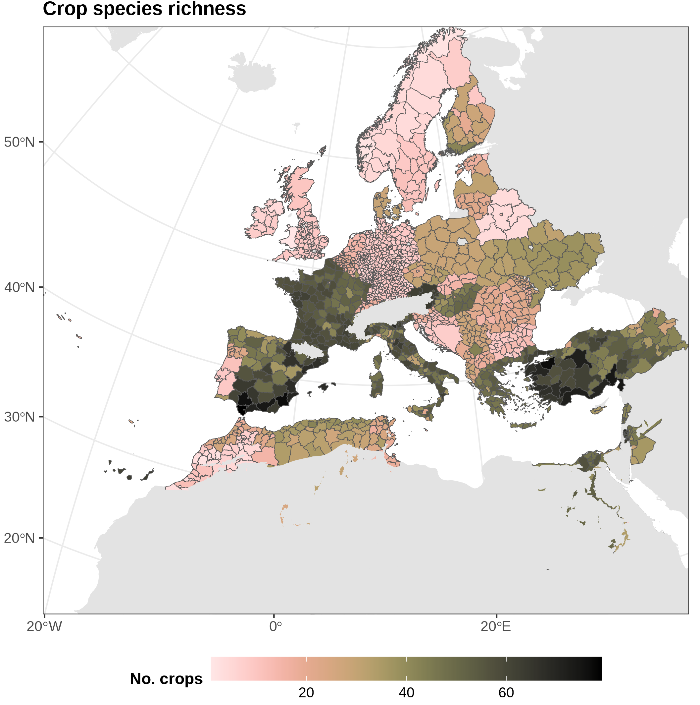

::::::::: stats-grid
::: stat-box
### 141

Unique crops
:::

::: stat-box
### 1,709

Administrative Units
:::

::: stat-box
### 92%

of admin. units at third administrative level (provinces, governorates, prefectures, NUTS3, etc).
:::

::: stat-box
### 47

Countries reporting official statistics
:::

::: stat-box
### 2023

Most frequent year reporting crop areas
:::

::: stat-box
### 94%

Correlation with FAO data on crop hectares for 47 countries included in CropMED
:::
:::::::::

::: section-block
# Crop species richness distribution

The following map shows the number of crops with at least one hectare reported at each administrative unit. 

:::

::: section-block
# Crop hectares distribution

In the following graph, the rectangle area shows the proportion of area occupied by each crop relative to the total cropped hectares included in *CropMED*. 

:::

::: section-block
# Data validation

Overall, we found high correlation ($R^2 = 0.094,\ \textrm{NRMSE}=0.0015$) between data from CropMED administrative units aggregated at the country-level and those reported from FAOSTAT (<https://www.fao.org/faostat/en/#data/QCL>). Here we show the validation for some of the most relevant crops included in *CropMED,* where countries with higher divergences are pointed out. 

:::

