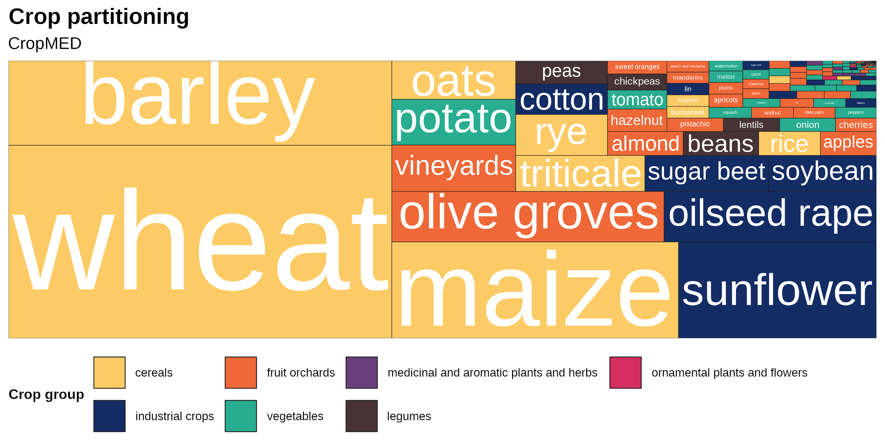
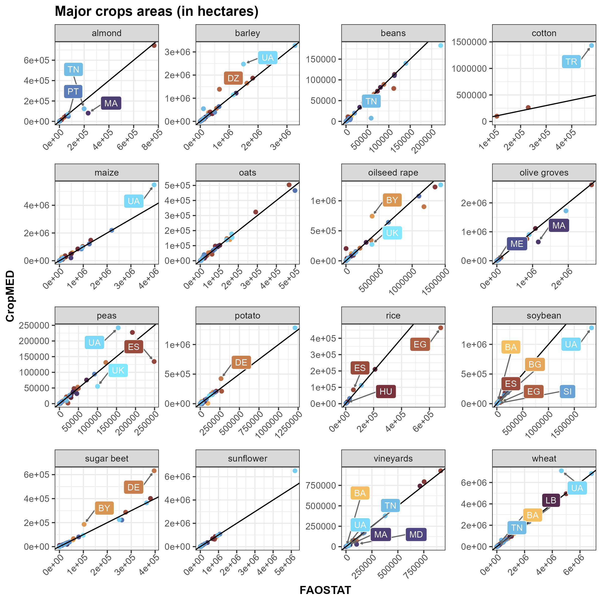
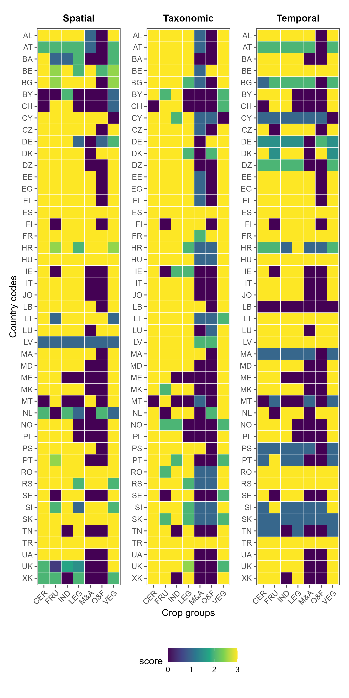

::::::::: stats-grid
::: stat-box
### 191

Unique crops
:::

::: stat-box
### 1,709

Administrative Units
:::

::: stat-box
### 92%

of admin. units at third administrative level (provinces, governorates, prefectures, NUTS3, etc).
:::

::: stat-box
### 48

Countries reporting official statistics
:::

::: stat-box
### 2023

Most frequent year reporting crop areas
:::

::: stat-box
### 94%

Correlation with FAO data on crop hectares for 47 countries included in CropMED
:::
:::::::::

::: section-block
# Crop hectares distribution
In the following graph, the rectangle area shows the proportion of area occupied by each crop relative to the total cropped hectares included in *CropMED*.

:::

::: section-block
# Data validation
Overall, we found high correlation ($R^2 = 0.094,\ \textrm{NRMSE}=0.0015$) between data from CropMED administrative units aggregated at the country-level and those reported from FAOSTAT (<https://www.fao.org/faostat/en/#data/QCL>). Here we show the validation for some of the most relevant crops included in *CropMED,* where countries with higher divergences are pointed out.

:::

::: section-block
# Data Quality Indicators
We assigned data quality scores to crop groups within each country across three dimensions: spatial (administrative level reached), temporal (updating periodicity of data) and taxonomic (number of unique crops reported for a crop group). The image below summarizes these scores, so that any user of the dataset can easily access the usefulness and limitations of any crop and country data.
{width="585"}
:::

 